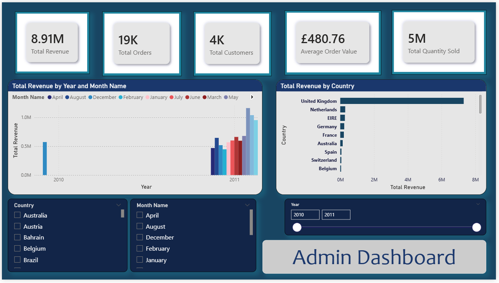
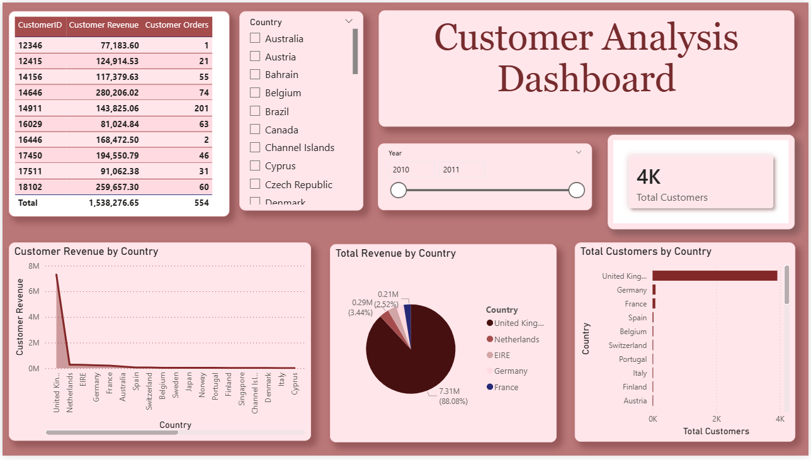
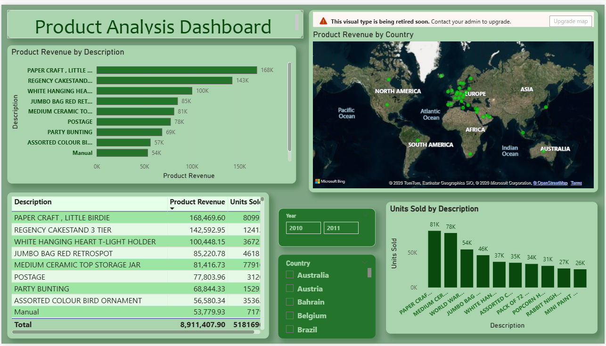
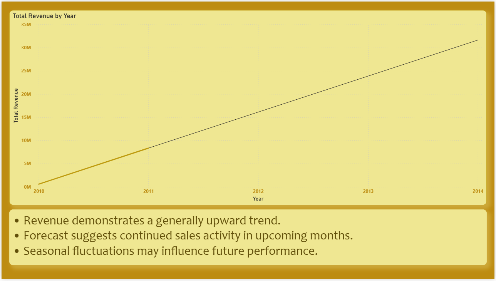

# E-Commerce Sales Analytics Dashboard

## Project Overview
This project analyzes an online retail dataset to uncover insights related to revenue, customer behavior, product performance, and future sales trends.

## Tools Used
- Power BI
- SQL
- Power Query
- DAX

## Dashboard Pages
1. Executive Dashboard
2. Customer Analysis
3. Product Performance
4. Sales Forecasting

## Key Insights
- Customer 14646 generated the highest revenue.
- PAPER CRAFT products were among the top-selling products.
- The United Kingdom contributed the highest revenue.
- Forecasting suggested continued sales activity.

## Screenshots of the project 

### Executive Dashboard

### Customer Analysis

### Product Performance

### Sales Forecasting

## Dataset
Online Retail Dataset from the UCI Machine Learning Repository.
